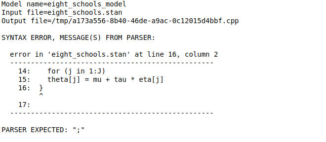
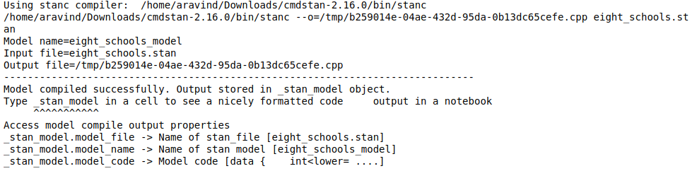
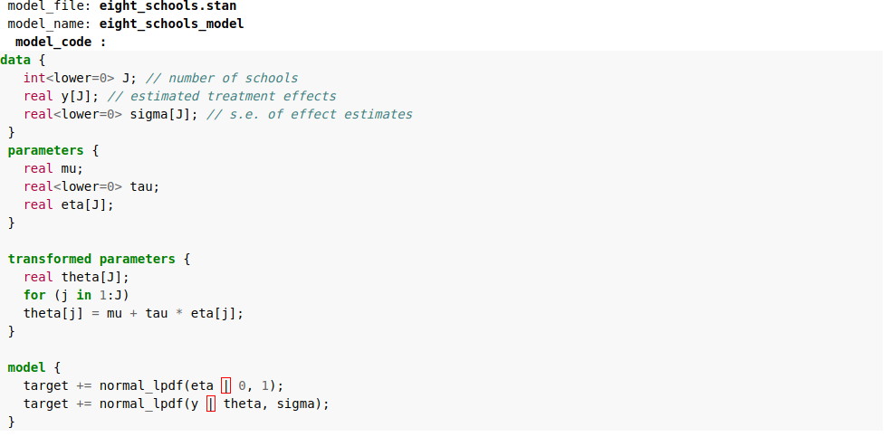

stanmagic
====================

An `%%stan` magic extension for Jupyter Notebook that helps to author/run Stan code within your notebook  interactive session.  After iterating with your model code and post succesful compile,  an object is returned in your namespace [_`stan_model` or an `<object_name> `specified in -v option] that can be used to pass the file/code further to `pystan` for model execution.

 The model_object has rich formatted html  output with syntax highlighting for stan code (via Stan pygments lexer). See below for example

For code

Installation
------------

Install ``stanmagic`` using pip

    $ pip install git+https://github.com/Arvinds-ds/stanmagic.git

#### Optional - Specifying compiler path [else defaults to pystan.stanc]

Ensure you have the STAN compiler (stanc) installed on your platform. Instructions
can be found at https://github.com/stan-dev/cmdstan

Ensure that stanc is in your path or you can pass the compiler path
manually  via the `-- stanc <compiler path>`

Usage
-----
See sample notebook https://github.com/Arvinds-ds/stanmagic/blob/master/StanMagic-Help.ipynb
for usage details

`%%stan [-v <object_name>]`

  Saves the cell code to a string. The code string can be accessed via ` _stan_model.model_code ` or `<object_name>.model_code ` (if you specified  [-v  <object_name\>] option)

`%%stan -f <stan_file_name> [-v <object_name>]`

  Saves the cell code to a file specified in <stan_file_name>. The file name can  be accessed via `_stan_model.model_file` or via ` <object_name>.model_file` (if you specified  [-v  <object_name\>] option)

`%%stan -f <stan_file_name> --save_only`
  Saves the cell code to a file specified in <stan_file_name>. Skips the compile step

`%%stan -f <stan_file_name> -o <cpp_file_name>`

  Saves the cell code to a file specified in `<stan_file_name>` and outputs the
  compiled cpp file to the file name specified by `<cpp_file_name>`

`%% stan -f <stan_file_name> --allow_undefined`

  passes the --allow_undefined argument to stanc compiler (not valid for pystan.stanc)

`%%stan -f <stan_file_name> --stanc <stanc_compiler>`

  Saves the cell code to a file specified in <`stan_file_name>` and compiles
  using the stan compiler specified in `<stanc_compiler>`. By default, it uses
  stanc compiler in your path. If your path does not have the stanc compiler,
  use this option (e.g `%%stan binom.stan --stanc "~/cmdstan-2.16.0/bin/stanc`") or
  to specifically use pystan use  `%%stan -f  binom.stan --stanc pystan`

__Note__:
  `%%stan`  magic currently outputs a `StanMagicOutput` object as default `_stan_model` object in your
  name_space
         The  ` -v` option allows you to specify an alternate compile output object name, so that
           you can use specified object name instead of `_stan_model`.
           This is useful if you have multiple %%stan model cells. Currently the output object
           exposes 3 attributes (`model_name`,` model_code`, `model_file`)
          ` [_stan_model | <object_name>].model_file -> Name of stan_file`
           `[_stan_model | <object_name>].model_name -> Name of stan model [None]`
          ` [_stan_model | <object_name>].model_code -> Model code`

Example
--------

#### Example 1

    In [1]: %load_ext stanmagic

    In [2]: %%stan -f eight_schools.stan
            data {
                int<lower=0> J; // number of schools
                real y[J]; // estimated treatment effects
                real<lower=0> sigma[J]; // s.e. of effect estimates
              }
              parameters {
                real mu;
                real<lower=0> tau
                real eta[J];
              }
              transformed parameters {
                real theta[J];
                for (j in 1:J)
                theta[j] = mu + tau * eta[j];
              }
              model {
                target += normal_lpdf(eta | 0, 1);
                target += normal_lpdf(y | theta, sigma);
              }

 

    In [3]: model = pystan.StanModel(file='eight_schools.stan')

#### Example 2

        In [1]: %load_ext stanmagic

        In [2]: %%stan -f eight_schools.stan
                data {
                    int<lower=0> J; // number of schools
                    real y[J]; // estimated treatment effects
                    real<lower=0> sigma[J]; // s.e. of effect estimates
                  }
                  parameters {
                    real mu;
                    real<lower=0> tau;
                    real eta[J];
                  }
                  transformed parameters {
                    real theta[J];
                    for (j in 1:J)
                    theta[j] = mu + tau * eta[j];
                  }
                  model {
                    target += normal_lpdf(eta | 0, 1);
                    target += normal_lpdf(y | theta, sigma);
                  }

	In [3]: _stan_model

       In [4]: model = pystan.StanModel(file=_stan_model.model_file)
       
#### Example 3

        In [1]: %load_ext stanmagic

        In [2]: %%stan  -v model_test
                data {
                    int<lower=0> J; // number of schools
                    real y[J]; // estimated treatment effects
                    real<lower=0> sigma[J]; // s.e. of effect estimates
                  }
                  parameters {
                    real mu;
                    real<lower=0> tau;
                    real eta[J];
                  }
                  transformed parameters {
                    real theta[J];
                    for (j in 1:J)
                    theta[j] = mu + tau * eta[j];
                  }
                  model {
                    target += normal_lpdf(eta | 0, 1);
                    target += normal_lpdf(y | theta, sigma);
                  }

       In [3]: model = pystan.StanModel(model_code=model_test.model_code)

#### Example 4

        In [1]: %load_ext stanmagic

        In [2]: %%stan 
                data {
                    int<lower=0> J; // number of schools
                    real y[J]; // estimated treatment effects
                    real<lower=0> sigma[J]; // s.e. of effect estimates
                  }
                  parameters {
                    real mu;
                    real<lower=0> tau;
                    real eta[J];
                  }
                  transformed parameters {
                    real theta[J];
                    for (j in 1:J)
                    theta[j] = mu + tau * eta[j];
                  }
                  model {
                    target += normal_lpdf(eta | 0, 1);
                    target += normal_lpdf(y | theta, sigma);
                  }

       In [3]: model = pystan.StanModel(model_code=_stan_model.model_code)
       
License
-------

*stan-jupyter-magic* is licensed under the MIT license. See the
license file for details.
